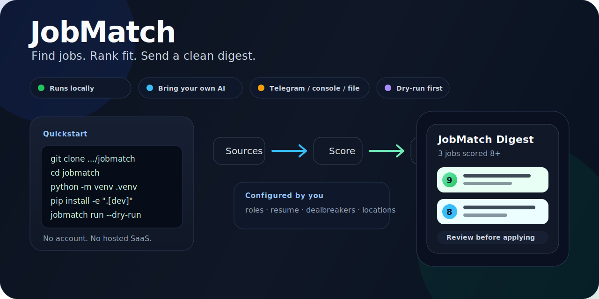

# JobMatch

**Local-first job discovery and scoring pipeline that finds roles, ranks fit, and sends a clean digest.**

<p align="center">
  
</p>

<p align="center">
  <a href="#quickstart">Quickstart</a> ·
  <a href="#telegram-output-preview">Telegram preview</a> ·
  <a href="docs/QUICKSTART.md">Noob setup guide</a> ·
  <a href="docs/EXAMPLE_RUN.md">Example run</a> ·
  <a href="docs/PRIVACY.md">Privacy</a>
</p>

| Output | Runs | AI | Status |
|---|---|---|---|
| Console, file, or Telegram digest | Locally on your machine | Bring your own OpenAI-compatible provider key | Alpha: usable, not magic |

JobMatch is for people who do not want to manually open ten job sites every day. You tell it what roles you want, what roles you hate, and what your CV actually says. It finds jobs, scores fit, removes duplicates, and shows you the shortlist.

It is **not** a hosted SaaS, not an auto-apply bot, and not a recruiter. It is a lazy-person filter for job hunting.

---

## What you get

JobMatch gives you a ranked shortlist instead of a pile of tabs.

### Telegram output preview

If you enable Telegram, the useful output looks like this:

```text
🧠 JobMatch Digest — 3 jobs score ≥8
Top score: 9

🔥 [9] Vendor Management & Sourcing Specialist
Example Company · Remote
Why it matched: sourcing, vendor management, supplier performance,
and logistics ownership all match your configured preferences.

⭐ [8] Operations Manager
Example Logistics · Singapore
Why it matched: operations leadership, process improvement,
and cross-functional delivery match your profile.
```

If you do not want Telegram yet, use console output first. Same shortlist, less setup.

---

## Quickstart

You need:

- Python **3.11, 3.12, or 3.13**
- Git
- one AI provider with an OpenAI-compatible API endpoint if you want scoring
- optional Telegram bot token/chat ID if you want phone notifications

### Install

```bash
git clone https://github.com/everfacture/jobmatch.git
cd jobmatch
python -m venv .venv
source .venv/bin/activate
pip install -e ".[dev]"
playwright install chromium
```

### First run

`jobmatch init` is interactive. Have a `.txt` or `.pdf` resume path ready. For a first smoke test, press Enter for defaults and leave optional AI/manual-apply helpers off; you can add provider keys later in `~/.jobmatch/.env`.

```bash
jobmatch init
jobmatch doctor
jobmatch run --dry-run
```

`--dry-run` is the safe test. It prints what would run and should not create a database or call an AI provider.

### Run the normal pipeline

```bash
jobmatch run
```

Default pipeline:

```text
discover -> enrich -> score -> dedup -> notify
```

---

## Make output go to Telegram

Edit:

```text
~/.jobmatch/.env
```

Set:

```env
JOBMATCH_NOTIFIER=telegram
JOBMATCH_TELEGRAM_BOT_TOKEN=your_bot_token
JOBMATCH_TELEGRAM_CHAT_ID=your_chat_id
JOBMATCH_TELEGRAM_THREAD_ID=
```

Then run:

```bash
jobmatch run --notify
```

If Telegram does not send, switch back to:

```env
JOBMATCH_NOTIFIER=console
```

Get the pipeline working locally first. Then make it fancy.

---

## What it does

- searches job boards you configure
- pulls fuller job descriptions where possible
- scores jobs against your profile, resume, and preferences
- handles obvious rejects/dealbreakers with deterministic rules first
- asks your configured AI provider to score ambiguous jobs
- removes duplicate jobs
- sends a digest to console, file, or Telegram

## What it does not do

- it does **not** auto-apply by default
- it does **not** guarantee every job board will scrape perfectly
- it does **not** replace your judgment
- it does **not** host your data in someone else's app
- it does **not** make cover letters safe to send without review

Job boards block bots. AI can be wrong. You still check the final job before applying.

---

## Tell it what jobs you want

The main file is:

```text
~/.jobmatch/preferences.yaml
```

Simple version:

```yaml
candidate:
  headline: "Backend engineer with Python, API, and cloud experience"

scoring:
  min_score: 7

  target_roles:
    - "Backend Engineer"
    - "Software Engineer"
    - "Platform Engineer"

  adjacent_roles:
    - "Data Engineer"
    - "Implementation Engineer"

  reject_roles:
    - "Sales Development Representative"
    - "Graphic Designer"

  dealbreakers:
    - "unpaid"
    - "commission only"

  positive_signals:
    - "Python"
    - "APIs"
    - "remote"

  negative_signals:
    - "cold calling"
    - "door to door"
```

Plain English:

| Field | Meaning |
|---|---|
| `target_roles` | jobs you actually want |
| `adjacent_roles` | jobs you might accept |
| `reject_roles` | jobs you do not want |
| `dealbreakers` | phrases that should kill a job |
| `positive_signals` | words that make a job more interesting |
| `negative_signals` | words that make a job less interesting |

Yes, you can list several different job types. If the roles are wildly different, expect noisier results and tighten your reject/dealbreaker rules.

---

## Make it personal

JobMatch builds the scoring prompt from your files:

- `~/.jobmatch/profile.json`
- `~/.jobmatch/resume.txt`
- `~/.jobmatch/preferences.yaml`
- the job posting

Best shortcut: paste your real CV into `resume.txt`, then make `profile.json` and `preferences.yaml` match the roles you actually want.

There is no magic "make it personal" button. The tool becomes personal because your input files are personal.

---

## AI providers

JobMatch uses any provider that exposes an OpenAI-compatible `/chat/completions` endpoint.

```env
JOBMATCH_LLM_BASE_URL=https://api.openai.com/v1
JOBMATCH_LLM_API_KEY=your_api_key_here
JOBMATCH_LLM_MODEL=gpt-4o-mini
```

Common base URLs:

| Provider | Base URL |
|---|---|
| OpenAI | `https://api.openai.com/v1` |
| OpenRouter | `https://openrouter.ai/api/v1` |
| DeepSeek | `https://api.deepseek.com/v1` |
| Groq | `https://api.groq.com/openai/v1` |
| Gemini OpenAI-compatible | `https://generativelanguage.googleapis.com/v1beta/openai` |
| LM Studio | `http://localhost:1234/v1` |
| Ollama | `http://localhost:11434/v1` |

See [`docs/PROVIDERS.md`](docs/PROVIDERS.md) for more detail.

---

## Main commands

| Command | What it does |
|---|---|
| `jobmatch init` | create local config files |
| `jobmatch doctor` | check setup and missing requirements |
| `jobmatch run --dry-run` | preview the pipeline safely |
| `jobmatch run` | run discover/enrich/score/dedup/notify |
| `jobmatch status` | show database counts |
| `jobmatch run cover --min-score 8` | optional cover-letter drafts, off by default |

Cover letters are drafts. Review them before sending. If you do not trust the output, do not use that stage.

---

## Privacy

JobMatch is local-first:

- your resume stays on your machine
- your profile stays on your machine
- your preferences stay on your machine
- your database stays on your machine

When scoring runs, relevant job/profile/resume text may be sent to the AI provider you configured. Use a provider you trust.

See [`docs/PRIVACY.md`](docs/PRIVACY.md) and [`SECURITY.md`](SECURITY.md).

---

## For non-technical users

This is easier than building your own job pipeline. It is not easier than opening a website.

You still need to:

1. install Python 3.11, 3.12, or 3.13
2. install Git
3. run terminal commands
4. edit a few text files
5. add an AI provider key

If that sounds painful, ask someone technical to set it up once. After that, the normal loop is just:

```bash
jobmatch run
```

---

## Docs

- [`docs/QUICKSTART.md`](docs/QUICKSTART.md) — step-by-step setup
- [`docs/EXAMPLE_RUN.md`](docs/EXAMPLE_RUN.md) — real smoke-test shape and costs
- [`docs/SCORING.md`](docs/SCORING.md) — how scoring works
- [`docs/PROVIDERS.md`](docs/PROVIDERS.md) — AI provider setup
- [`docs/PRIVACY.md`](docs/PRIVACY.md) — what stays local and what goes to AI

---

## Upstream / fork note

JobMatch is a heavily stripped-down fork/adaptation of [ApplyPilot](https://github.com/Pickle-Pixel/ApplyPilot), the open-source AGPL-3.0 job-application agent by [Pickle-Pixel](https://github.com/Pickle-Pixel).

This version is rewritten for local-first config, manual review, simpler scoring, and bring-your-own-AI usage.

---

## License

See [`LICENSE`](LICENSE).
